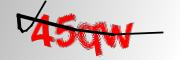
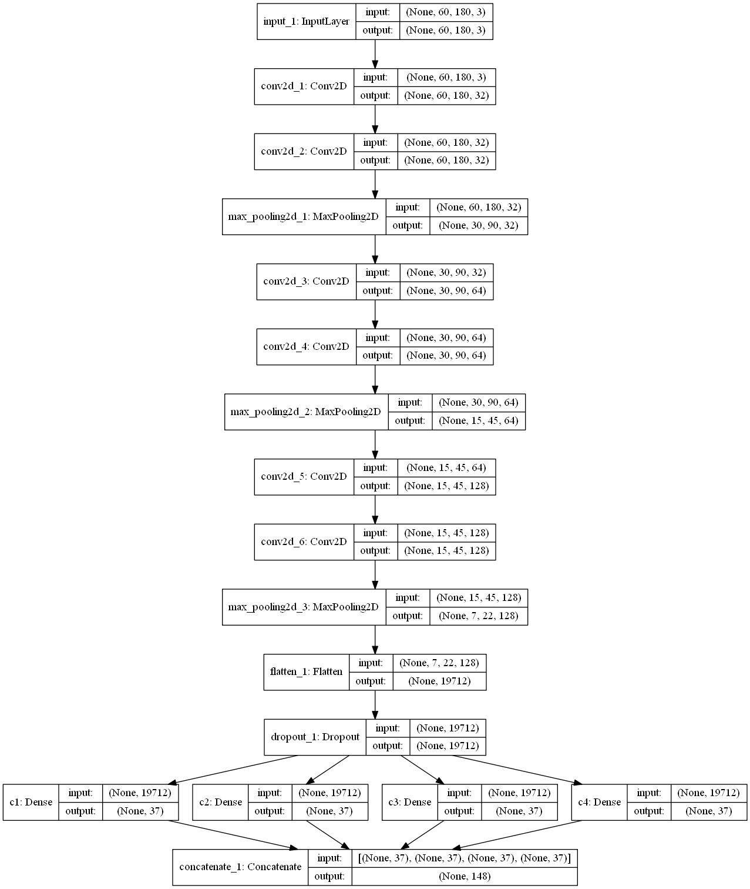
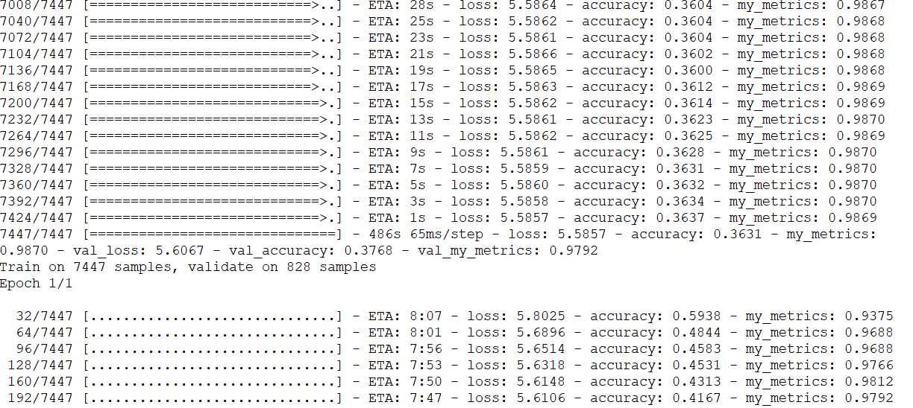
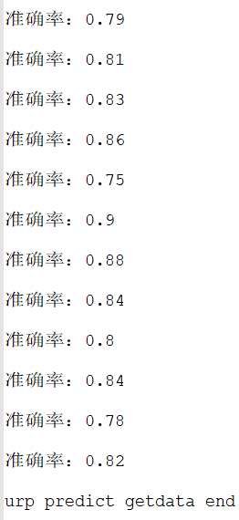

# URP教务系统验证码识别


## 环境
 - Keras 2.3.1   
 - tensorflow 1.15.0


## 目录

 ```
	|-- dataset 							//用来存放本地生成的验证码图片
	|-- output								//用来存放模型文件
		|-- captcha_classfication.png		//模型框图
		|-- captcha_model.h5				//用本地生成的验证码训练的模型
		|-- captcha_model_weights.h5		//用本地生成的验证码训练的模型权重
		|-- urp_captcha_model.h5			//用URP教务系统生成的验证码训练的模型
		|-- urp_captcha_model_weights.h5	//用URP教务系统生成的验证码训练的模型权重
	|-- ROOT								//用来本地生成验证码的jsp文件
		|-- WEB-INF							//相关配置文件目录
		|-- test.jsp						//返回验证码字符串
	|-- urp_dataset							//用来存放带标签的URP教务系统的验证码图片
	|-- captcha_train_data.pkl				//本地生成验证码的训练数据
	|-- urp_captcha_train_data.pkl			//URP教务系统验证码的训练数据
	|-- get_dataset.py						//爬取图片，并生成训练模型用的数据集
	|-- predict.py							//测试本地生成验证码的识别准确率
	|-- train.py							//训练模型，根据所用本地数据集或URP数据集，需修改少量代码，生成不同的模型
	|-- urp_predict.py						//测试URP验证码的识别准确率，并保存训练正确的模型
	|-- others
		|-- 1.txt							//训练urp_captcha_model.h5的输出	
		|-- pic1.png						//1.txt截图
		|-- 2.txt							//运行urp_predict.py的输出
		|-- pic2.png						//2.txt截图
		|-- urp_dataset.tar					//压缩过的8000多张urp_dataset里的图片
  ```

## 主要步骤

1. 使用jsp调用Kaptcha库在本地生成带标签的验证码

2. 训练模型

由于本地生成的验证码和URP教务系统的验证码有些不同，
此时预测URP教务系统的验证码的准确率比较低

本地生成验证码



URP教务系统的验证码


3. 使用训练好的模型预测URP教务系统的验证码，并保存预测正确的验证码

这样就获得了带标签的URP教务系统的验证码

4. 使用带标签的URP教务系统的验证码训练模型

此时模型的准确率有所提高，但是还不够高

5. 重复步骤3、4、5，直到模型的准确率达到要求

迭代训练模型，提高准确率


## 模型框图



## 主要代码讲解

### train.py

自定义评价函数

损失函数的结果不会用于训练过程中

评价函数的结果不会用于训练过程中

```python
def my_metrics(y_true, y_pred):
    predict = tf.reshape(y_pred, [-1, word_len, word_class])
    max_idx_p = tf.argmax(predict, 2)
    max_idx_l = tf.argmax(tf.reshape(y_true, [-1, word_len,word_class]), 2)
    correct_pred = tf.equal(max_idx_p, max_idx_l)
    _result = tf.map_fn(fn=lambda e: tf.reduce_all(e),elems=correct_pred,dtype=tf.bool)
    return tf.reduce_mean(tf.cast(_result, tf.float32))

```


编译模型

```python
opt = Adadelta(lr=0.1)
model.compile(loss = 'categorical_crossentropy', optimizer=opt, metrics=['accuracy',my_metrics])

```

导入模型

```python

model = load_model("output/urp_captcha_model.h5",custom_objects={'my_metrics': my_metrics})

```

### urp_predict.py


在有的教务系统里面，如果badCredentials在Location里面，说明验证码正确，用户名密码错误。

在有的教务系统里面，验证码错误或用户名密码错误，都会重定向到badCredentials。

```

r2 = s.post(url2,data=data,allow_redirects=False)
code = str(r2.headers)
#print(code)
#print(r2.text)
if 'badCredentials'  in code:
	right_code=right_code+1

```

### 其他


由于1、l、I 或 o、O、0 容易混淆，

某些教务系统在生成验证码可能删去容易混淆的字符。


1.txt 截图

训练时准确率达到95%以上



2.txt 截图

实际情况下，
由于在线爬取的验证码与训练的数据集有所不同，
准确率约为80%至90%




## 参考链接


GitHub - yang00yang/captcha_yh: 基于CNN，keras的验证码识别项目

https://github.com/yang00yang/captcha_yh


